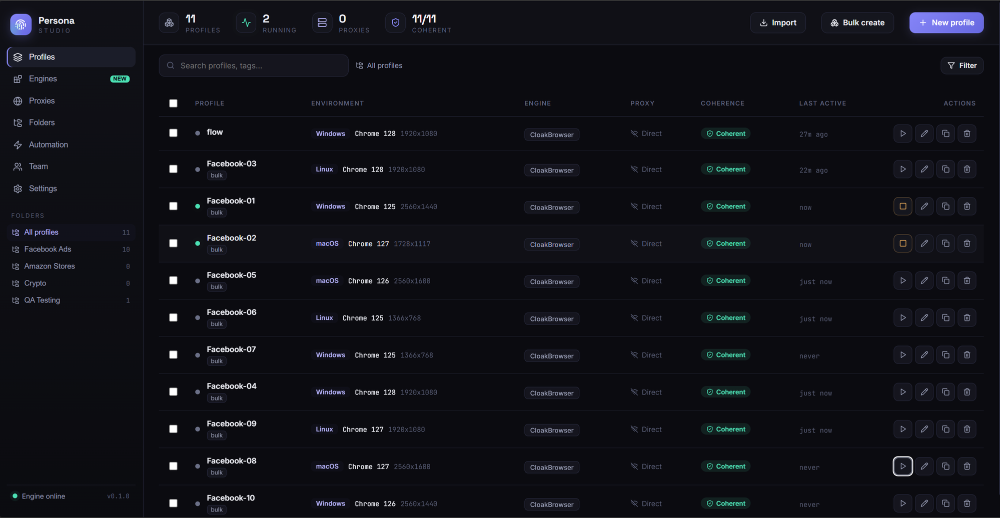

<div align="center">

# Persona

### Open-source, self-hosted anti-detect browser & profile manager

Create browser profiles that each look like a real, separate device — a
*coherent* fingerprint, its own proxy, and a persistent session — then manage
and launch them from a clean web console or CLI.

A self-hosted alternative to GoLogin, Multilogin and AdsPower.


<br>



</div>

---

## Why Persona?

Most fingerprint tools randomise each value on its own — and that's exactly what
gets them caught. Anti-bot systems don't read values in isolation; they
**cross-check** them. A macOS user-agent with an NVIDIA GPU, or a 4-core phone
claiming a 1440p screen, is an instant tell.

Persona's core idea is **coherence**. It picks a realistic device archetype
first, then draws *every* value (OS, user-agent, GPU, screen, CPU, RAM, timezone,
language) from that archetype's real-world pool. The result is an identity whose
parts all agree — and a live coherence check that proves it, both in the engine
(`validate()`) and in the dashboard's real-time meter.

That coherence-first design is the thing commercial tools don't surface, and it's
what makes Persona distinctive.

## Persona vs the commercial tools

|  | **Persona** | Multilogin | GoLogin | AdsPower |
|---|:---:|:---:|:---:|:---:|
| **Price** | **Free** | from ~$99/mo | from ~$49/mo | free tier + paid |
| **Open source** | ✅ MIT | ❌ | ❌ | ❌ |
| **Self-hosted — data never leaves your machine** | ✅ | ❌ cloud | ❌ cloud | ❌ cloud |
| **Live coherence meter** (proves the fingerprint agrees with itself) | ✅ | ❌ | ❌ | ❌ |
| **Trust checker** — grades the *real* browser, not the config | ✅ | ❌ | ❌ | ❌ |
| **Patched-binary stealth engine** | ✅ Cloak / Camoufox | ✅ | ⚠️ | ✅ |
| **Proxy pool + leak/DNS/TLS tests** | ✅ | partial | partial | partial |
| **CLI + Python API** | ✅ | ❌ | limited | limited |
| **Cloud team sync** | ❌ *(local-first by design)* | ✅ | ✅ | ✅ |

<sub>Pricing and feature comparison are approximate and based on each vendor's public plans at the time of writing — check their sites for current details. Persona doesn't do hosted team sync on purpose (see the roadmap); everything else is local and free.</sub>

## What's in the box

Persona is a monorepo with two parts that work together:

```
persona-studio/
├── engine/        Python core — fingerprints, storage, launcher, CLI
├── dashboard/     React web console — the visual profile manager
└── start.bat      Windows one-click launcher (installs + starts both)
```

| | |
|---|---|
| 🧬 **Coherent fingerprints** | OS, UA, GPU, screen, hardware, timezone & language always agree |
| 🛡️ **Live coherence meter** | Real-time consistency score as you edit — nobody else shows this |
| 🌐 **Proxy-aware** | Set a proxy's country and locale/timezone auto-align to it |
| 🎛️ **Rich editor** | Canvas, WebRTC, audio, fonts, geolocation, media devices, DNT |
| 💾 **Persistent sessions** | Cookies & localStorage survive between launches |
| 🍪 **Cookie import/export** | Move a logged-in session in or out — Cookie-Editor JSON, Playwright state, or `cookies.txt` |
| 🔎 **Trust checker** | Grades the *real* browser against the checks a fingerprinter runs |
| ✨ **Auto-adjust** | One click aligns a profile to what its browser actually presents — grade jumps to A |
| 📡 **Proxy & leak test** | Exit IP, country and timezone match + WebRTC leak detection |
| 🌐 **DNS leak check** | Confirms name lookups exit through the proxy, not your real ISP's resolver |
| 🌐 **Proxy pool** | Import, health-check and assign proxies round-robin across profiles |
| 🔐 **TLS/JA3 check** | Reads the handshake fingerprint — the one layer JS injection can't reach |
| ❤️ **Health overview** | One page: coherence, proxy, trust grade and warm-up schedule per profile |
| 🔑 **Encrypted vault** | Proxy passwords encrypted at rest behind a master password |
| 🧩 **Extensions** | Per-profile unpacked extensions, isolated from every other profile |
| ✨ **Warm-up + schedule** | Human-paced browsing (per-vertical presets) so a fresh profile isn't obviously fresh — and a recurring schedule so it never goes cold |
| 🤖 **Automation attach** | Drive a live profile from Selenium, Puppeteer or Playwright over CDP |
| 🔁 **Bulk edit** | One change applied to hundreds of profiles, coherently |
| 📥 **Migrate in** | Import profiles from GoLogin, AdsPower or Multilogin exports |
| 📦 **Bulk create at scale** | Generate thousands of coherent profiles — mixed OS, country, browser, per-profile hardware |
| 🗂️ **Folders, tags, search** | Organize hundreds of accounts |
| 🖥️ **Real browser** | Launches a real browser, per-profile isolation |
| 🔌 **Pluggable engines** | Swap the stealth backend: CloakBrowser, Camoufox, Patchright, Playwright |
| 🔗 **Startup URLs** | Each profile opens the pages you want, in its own tabs |
| 🖱️ **One-click launcher** | `start.bat` installs everything and starts both halves on Windows |
| ⌨️ **CLI + Python API** | Script it or drive it by hand |

## Quick start

**Prerequisites:** [Python 3.9+](https://www.python.org/downloads/) and (for the
dashboard) [Node.js 18+](https://nodejs.org/). Check with `python --version` and
`node --version`.

```bash
git clone https://github.com/TechQaiser/persona-studio.git
cd persona-studio
```

### Easiest (Windows): one-click launcher

Double-click **`start.bat`** in the project folder. On first run it installs
everything, lets you pick the default browser engine (CloakBrowser first), then
starts the engine API + dashboard and opens the console in your browser. Two
terminal windows stay open while it runs — close them to stop. To re-run setup,
delete `.persona_setup_done`.

The engine you pick "wins": it becomes the default for every new profile you
create afterwards, from the batch menu, the CLI, or the dashboard. Change it any
time with `persona default-engine cloak`.

Prefer to do it by hand, or on macOS/Linux? Follow the manual steps below —
the two parts are independent, so you can run the engine, the dashboard, or both.

### 1. Engine (backend)

```bash
cd engine
pip install -e ".[launch]"      # omit [launch] to skip Playwright
playwright install chromium     # downloads the browser (needed for `launch`)

persona create acct-01 --os windows --locale en-US
persona launch acct-01          # opens a Chromium window; close it to exit
```

> **Windows / PowerShell:** keep the quotes around `".[launch]"` exactly as
> shown — without them the shell mis-reads the brackets.
>
> **`persona` not recognized?** The install worked but its Scripts folder isn't
> on your PATH. Either reopen your terminal, or run it as a module instead:
> `python -m persona create acct-01 --os windows --locale en-US`.

### 2. Dashboard (frontend)

```bash
cd dashboard
npm install
npm run dev                      # then open http://localhost:5173
```

> The dashboard runs on its own with in-memory **sample data**, so you can
> explore it without the engine (the footer shows *Demo mode*).

### 3. Connect them (launch real browsers from the dashboard)

Start the engine's API, then reload the dashboard — its footer flips to
*Engine online* and the launch (▶) button now opens a **real Chromium window**,
with profiles saved to disk.

```bash
cd engine
pip install -e ".[api,launch]"
playwright install chromium
persona serve                    # HTTP API on http://localhost:8787
```

Leave `persona serve` running and start the dashboard (`npm run dev`) in a second
terminal. That's it — clicking ▶ launches the profile for real.

Full details live in each part's README:
[engine/README.md](engine/README.md) · [dashboard/README.md](dashboard/README.md).

## How it works

```
             ┌──────────────┐
   pick OS → │  archetype   │   curated real-world combos (engine/persona/devices.py)
             └──────┬───────┘
                    │  every value drawn from this archetype's pool
                    ▼
             ┌──────────────┐        ┌──────────────┐
             │ Fingerprint  │───────▶│  validate()  │   coherence gate
             └──────┬───────┘        └──────────────┘
                    │
        ┌───────────┴────────────┐
        ▼                        ▼
  context options          stealth.js init script
  (UA, viewport, locale,   (navigator.platform, WebGL,
   timezone, proxy, CH)     hardwareConcurrency, webdriver, canvas noise)
        └───────────┬────────────┘
                    ▼
          Chromium (persistent context per profile)
```

See [docs/architecture.md](docs/architecture.md) for the full walkthrough,
including how to connect the dashboard to the engine.

## Manager + pluggable engines

Persona's job is to be the **manager** — coherent identities, proxies, sessions,
folders, and a dashboard. The actual stealth browser is a **pluggable engine** you
choose per profile:

| Engine | Strength | Notes |
|---|---|---|
| `cloak` ⭐ | Patched Chromium binary | **Recommended.** CloakBrowser — C++-level fingerprint/TLS/CDP patches; reaches Cloudflare/DataDome/reCAPTCHA-v3-grade evasion. |
| `camoufox` ⭐ | Patched Firefox (C++-level) | **Recommended.** Among the strongest open options; brings its own coherent fingerprint. |
| `patchright` | Runtime-patched Playwright | Drop-in; fixes `webdriver`/CDP leaks the stock engine can't. |
| `playwright` | Built-in, always available | Stock Chromium + injected stealth script. Passes basic bot tests (BrowserScan, sannysoft); can't beat TLS/CDP-level detection. |

```bash
persona engines                          # see what's installed + which is default
persona create acct-01 --engine cloak    # pick a backend per profile
persona default-engine cloak             # set the default for new profiles
```

CloakBrowser is the default out of the box. The last engine you choose anywhere
becomes the default for the next profile you create.

Being honest about limits: pure JavaScript injection (the `playwright` engine)
has a ceiling — for Cloudflare / DataDome / reCAPTCHA-v3-grade evasion, pair a
runtime-patched engine with a residential proxy and a warmed-up session. Persona
stays the same manager over all of them.

## Roadmap

**Built**

- [x] Coherent fingerprint engine + `validate()`
- [x] Profile storage, import/export, persistent sessions
- [x] Playwright launcher with proxy support
- [x] Full CLI
- [x] Web dashboard: profile grid, fingerprint editor, coherence meter, bulk create, proxies
- [x] HTTP API (`persona serve`) connecting the dashboard to the engine — launch real browsers from the UI
- [x] Pluggable launch engines (CloakBrowser, Camoufox, Patchright, Playwright)
- [x] Persisted default engine + one-click Windows launcher (`start.bat`)
- [x] Per-profile startup URLs
- [x] Cookie import/export (CLI, API, dashboard) — Cookie-Editor JSON,
      Playwright storage state, Netscape `cookies.txt`

- [x] Account warm-up — human-paced browsing that ages a fresh profile
- [x] Local automation API — `persona attach` opens CDP for Selenium/Puppeteer/Playwright,
      plus a dashboard **Automation** page (one-click attach + copy-paste connect snippets)
- [x] Multi-profile synchronizer — `persona apply`, plus "Edit all" in the dashboard
- [x] Proxy tester + WebRTC leak checker (`persona proxy test`)
- [x] Fingerprint trust checker (`persona trust`) — grades the real browser, not the config
- [x] Extensions manager, plus fonts, media devices, ClientRects & audio noise

- [x] TLS/JA3 handshake checker (`persona tls`) — the pre-JS network layer
- [x] Encrypted secrets at rest (`persona vault`) — proxy passwords, master-password
- [x] Geolocation aligned to the proxy country + WebRTC IP-handling enforced at launch

- [x] Import from GoLogin / AdsPower / Multilogin (`persona import-from`)

- [x] Auto-adjust (`persona align`) — align a profile to what its browser really
      shows so a low trust grade jumps to A
- [x] Bulk create at scale (`persona bulk-create`, dashboard) — thousands of
      coherent profiles across OS / country / browser, with a paginated grid
- [x] Proxy pool — import a list, health-check it, and assign round-robin across
      profiles (aligning each profile's locale to its proxy country)
- [x] Dashboard-side import (GoLogin / AdsPower / Multilogin) — an Import button
      that maps each export to a coherent profile

- [x] DNS leak checker (`persona dns`) — reads which resolvers actually saw the
      lookups and fails if any escaped the proxy's country
- [x] Warm-up presets per vertical (`--preset ads|ecommerce|crypto|social|news`)
- [x] Scheduled warm-up (`persona schedule`) — recurring, unattended; the server
      fires due runs from a background thread, or drive it from cron with
      `schedule run-due`
- [x] Profile health overview — one page grading coherence, proxy, cached trust
      and warm-up schedule across every profile, with one-click fix
- [x] Fingerprint collision detector (`persona collisions`, Health page) —
      catches profiles that share a fingerprint before a site links the accounts
- [x] Backup & restore (`persona backup` / `restore`) — a profile **and its
      session** zipped into one portable file, movable to another machine
- [x] Bulk grid actions (warm up / export the selection) + tag filtering
- [x] Folders manager (dashboard) — create / rename / delete folders with live
      counts; renaming or deleting one moves its profiles instead of dropping them
- [x] Settings page (dashboard) — theme, default launch engine, storage location
      and data summary, backed by `GET`/`PUT /api/config`
- [x] Mobile (Android) profiles — coherent handset fingerprints (real model in
      the UA, matching GPU/screen/RAM) with touch + device-scale emulation at launch
- [x] Session health (`persona session`, dashboard) — reads the cookie jar and
      flags expired / soon-to-expire cookies and which logins are still live
- [x] Duplicate as template — clone a profile's settings with a *fresh* coherent
      fingerprint, so the copy is a distinct device, never a fingerprint twin
- [x] Per-profile activity log — launches, warm-ups, trust runs and session
      checks, shown as a timeline in the editor

**Next**

- [ ] Cloud sync + team roles — deliberately unbuilt: it needs a hosted backend,
      accounts and a threat model of its own. Persona stays local-first until
      that's designed properly rather than bolted on.

Want to help? See [CONTRIBUTING.md](CONTRIBUTING.md).

## Legitimate use & responsibility

Persona is a tool for **legitimate multi-account management**: marketing agencies
handling many client ad accounts, QA and ad-verification testing, web-automation
development, and privacy research — the same use cases served openly by
commercial anti-detect browsers.

Do **not** use it for fraud, credential stuffing, spam, evading bans you've
earned, or anything that violates a site's terms of service or the law. You are
responsible for how you use it.

## License

[MIT](LICENSE) — free to use, modify and distribute.
